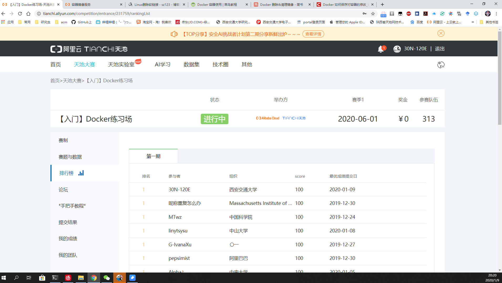

## 阿里天池入门第一步——【入门】Docker练习场   

研一上学期就快要结束了，感觉自己没有很好的进入状态，导致没啥产出。所以为了让自己有所成长，我想在下学期参加一次阿里天池比赛，先立一个flag，哈哈哈。说干就干，现在阿里天池比赛的提交方式基本都是提交docker，所以学习docker的使用方式很重要。刚好天池有[==Docker练习场==](https://tianchi.aliyun.com/competition/entrance/231759/introduction?spm=5176.12281973.1005.1.3dd52448iXvNMY)，我就报名参加了，果然比赛很锻炼人，为了解决问题，我学习到了很多新的知识。

---


### Docker基础知识    

#### 1. Docker for Windows下载与安装       
参考博客的网址如下：
```
https://www.cnblogs.com/stilldream/p/10627831.html
```
Windows上配置文件的默认位置是 %programdata%\docker\config\daemon.json

#### 2. Docker容器的使用   
参考博客网址如下：   
- Docker 启动、停止、进入：https://www.runoob.com/docker/docker-container-usage.html
- Docker 保存对容器的修改：https://blog.csdn.net/bocai_xiaodaidai/article/details/92838004  
- Docker 删除&清理镜像：https://www.jianshu.com/p/05d0c77d26d3   
- docker 批量删除镜像、容器：https://www.cnblogs.com/kala00k/p/11183279.html   

该题的要求见比赛网址：https://tianchi.aliyun.com/competition/entrance/231759/introduction   
其中有一个手把手教程可以参考，需要开通开通[阿里云容器镜像服务](https://cr.console.aliyun.com)，这是免费的，按照教程走就行。   

### 手把手超详细操作说明（搬的阿里云教程，但部分地方会有我自己的理解与说明）   

容器基本概念：云原生技术公开课第2讲     
https://edu.aliyun.com/lesson_1651_13082?#_13082    

一、安装 Docker 环境   
以 Ubuntu 系统为例：

```
$ sudo apt-get update
$ sudo apt install docker.io
```
面向 Mac OS 和Windows 操作系统还推出了Docker桌面。    
Mac：https://docs.docker.com/docker-for-mac/install/     
Windows：https://docs.docker.com/docker-for-windows/install/

二、开通阿里云容器镜像服务    
阿里云容器镜像服务 https://www.aliyun.com/product/acr?     
免费开通镜像托管，本次练习任务请将仓库地域选择上海。建议设置私有仓库，并一定牢记仓库密码，后续提交需要使用。    
开通后进入镜像仓库https://cr.console.aliyun.com

切换标签页到命名空间，创建地址唯一的命名空间

根据任务/比赛要求选择对应的地域（本次练习选择上海），其他的按照自己需求选择或填写。

选择代码源为本地仓库，灵活度大，完成创建。

点击管理，可查看详情。

详情页如下，有基本的操作命令，仓库地址一般使用公网地址即可。
    

三、构建镜像并推送    
在安装好Docker环境的本机/服务器构建并推送容器镜像。过程中可能会使用docker命令，如拉取docker pull，推送docker push，构建docker build等等。      
为简化构建镜像的难度，天池已准备了常用的Python基础镜像，可直接拉取使用，更多基础镜像说明点击。
自行构建镜像请确保安装curl.       

```
docker pull registry.cn-shanghai.aliyuncs.com/tcc-public/python:3
```

1. 准备所需文件    
新建一个文件夹（例如tianchi_submit_demo）用于存放这次任务镜像所需的文件，文件夹中内容示例，其中hello_world.py中是各位自己的代码部分    
Dockerfile配置文件参考，Dockerfile是固定名称，注意首字母大写。Dockerfile中命令皆大写：
```
#Dockerfile配置文件参考
# Base Images
## 从天池基础镜像构建
FROM registry.cn-shanghai.aliyuncs.com/tcc-public/python:3 #这个可以替换成本地镜像，也可以从别的地方拉取

## 把当前文件夹里的文件构建到镜像的根目录下
ADD . /

## 指定默认工作目录为根目录（需要把run.sh和生成的结果文件都放在该文件夹下，提交后才能运行）
WORKDIR /

## 镜像启动后统一执行 sh run.sh
CMD ["sh", "run.sh"]
```
run.sh参考：

```
python hello_world.py
```
2. 构建镜像并推送    
执行docker build -t registry.cn-shenzhen.aliyuncs.com/test_for_tianchi/test_for_tianchi_submit:1.0 .    
注意：registry.~~~是上面创建仓库的公网地址，用自己仓库地址替换。地址后面的：1.0为自己指定的版本号，用于区分每次build的镜像。最后的.是构建镜像的路径，不可以省掉。     

构建完成后可先验证是否正常运行，正常运行后再进行推送。     

```
CPU镜像：docker run your_image sh run.sh     
GPU镜像：nvidia-docker run your_image sh run
```
  
推送到镜像仓库 docker push registry.cn-shenzhen.aliyuncs.com/test_for_tianchi/test_for_tianchi_submit:1.0
如果这步出错，可能你没有登录，按照仓库里描述操作登录即可。

> 第一次推送会比较耗时     

四、 提交验证运行结果     
在左侧【提交结果】中填写推送的镜像路径、用户名和密码，即可提交。根据【我的成绩】中的分数和日志可以查看运行情况。
     

最后的最后，附上我的hello_world.py代码：

```
#hello_world.py

import pandas as pd
import json

d = {}
#Q1
# print("Hello world")
d.update(Q1='Hello world')

data = pd.read_csv("/tcdata/num_list.csv", header=None)
# data = pd.read_csv("num_list.csv", header=None)

#Q2
data1 = data
sum = 0
for i in range(len(data1)):
    sum += int(data1.loc[i])
# print(sum)
d.update(Q2=sum)

#Q3
data2 = data
data2 = data2.values.tolist()
list = []
for i in range(len(data2)):
    list.append(data2[i][0])
list.sort(reverse=True)
# print(list[0:10])
d.update(Q3=list[0:10])

# print(d)
with open('result.json', 'w', encoding='utf-8') as f:
    f.write(json.dumps(d, ensure_ascii=False))

```
==注意：==    
我就是在这里遇到了点问题，从 registry.cn-shanghai.aliyuncs.com/tcc-public/python:3 里pull下来的镜像没有pandas模块，所以导致我push完成提交结果的时候报错没有pandas模块的错误。     
我通过先运行Docker镜像，再在镜像中安装pandas模块，最后保存提交来解决这个问题。 
```
$ docker run -it XXX /bin/bash   #XXX为镜像名称
#这时会进入终端
root@ed09e4490c57:/# exit #这就可以退出终端了

$ docker ps #查看正在运行的容器.
$ docker exec –it  XXXXXXXXXX bash  #进入正在运行的容器内，XXXXXXXXXX是镜像ID
#进入容器后，就可以修改镜像了，比如修改镜像中已经部署的代码或者安装新的软件或包等，修改完成之后，exit 退出容器
$ docker commit 3bd0eef03413  demo：v1.1 #提交你刚才修改的镜像，新的镜像名称为demo，版本为v1.1
```
修改Dockerfile中FROM后的基础镜像来源，改成本地的镜像，再次进行push，就完成啦！   

留个图纪念一下，嘿嘿！


### **感谢你耐心的阅读！ ( * ^ _ ^ * )**